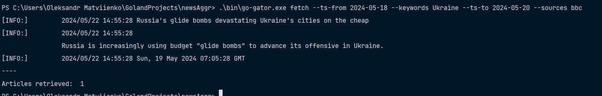
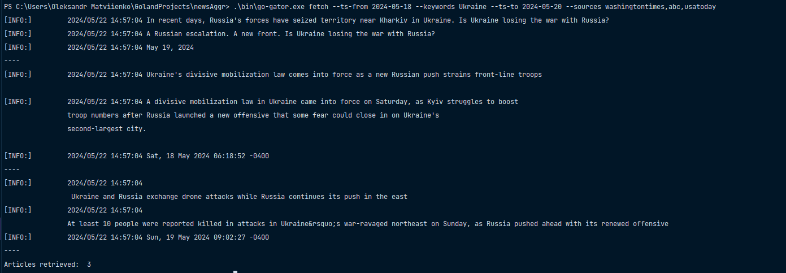

## Go Gator
### News Aggregator CLI App, implemented in golang

## Implemented:
1. Reading from .xml, .json, .html files
2. Parsing that data into structures
3. Filtering news by parameters (provided by user, handling user input)
4. Logging

## Documentation
Here I would like to explain the purpose of each directory.
 
### 1. Cmd
Main logic of the application is there. Cmd has few sub folders:
1. Parsers  - Parsing various data types
2. Parsing Instructions - Filtering news by various parameters
3. Types - Types folder is used to avoid cycling imports. Object that are used in multilpe packages (e.g. Parsing Parameters) lives there
4. Utils - Helper functions, in order to separate them with main logic

### 2. Data
Files from where data is retrieved are located in this folder

### 3. Logger
Better logging functionality. I saw it on one project, and from that moment always use this practice.

### 4. Usage
GoGator has only root and fetch commands. Root just prints simple message, and fetch performs actual
news retrieval and filtering.

You can run this application, by running:
 
> `go build -o ./bin/go-gator.exe`   
> `./bin/go-gator fetch`  

P.S. I am using windows, if You are using Linux just miss the .exe extension.   
I am not sure how use it in the Mac, but I suppose also miss .exe part.

Available parameters:  
> `--ts-from 2024-05-12` News will be retrieved starting from that timestamp  
> `--ts-to 2024-05-18` No news will be retrieved, where publication date is bigger than provided parameter  
> `--sources bbc,washingtontimes` News will be retrieved ONLY from mentioned sources (separated by ',')   
> `--keywords Ukraine,Chine` News will be filtered by existence of keywords in title or description  

## 5. Examples:
`.\bin\go-gator.exe fetch --ts-from 2024-05-18 --keywords Ukraine --ts-to 2024-05-20 --sources bbc`

`.\bin\go-gator.exe fetch --ts-from 2024-05-18 --keywords Ukraine --ts-to 2024-05-20 --sources washingtontimes,abc,usatoday`

