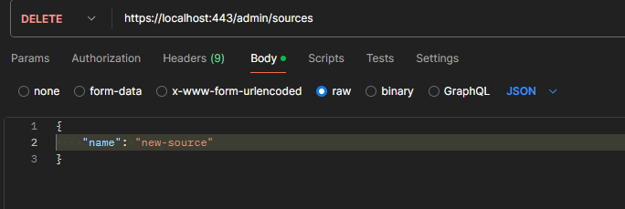

## Go Gator
### News Aggregator Server

## Implemented:
1. Handlers for managing sources (Admin API)
2. Handler for retrieving news by given parameters:
3. Verifying user input, displaying appropriate messages/errors
4. Dynamic fetching news from external APIs:
    - Making requests to external APIs (ABC,BBC, etc.), and store it. Not from static files as were before
5. Covered code with unit and integration tests
6. Made server secure with HTTPS
7. Added logging
8. Containerized application with docker

## Documentation
Here I would like to explain the purpose of each directory.
 

### 1. Cmd
Main logic of the application is there. Cmd has few sub folders:
1. Parsers  - Parsing various data types
2. Filters - Filtering news by various parameters
3. Types - Types folder is used to avoid cycling imports. Object that are used in multiple packages (e.g. Parsing Parameters) lives there
4. Server - server initialization and configuration
5. Server/handlers - handlers attached to the server
6. Validator - Validating layer using chain of responsibility pattern

### 2. Docs 
Documentation, specfile and C4 model, and usage/response examples with images 

## Server Handlers
Go-Gator server contains few handlers. Few of them are used by admins to manage list of available
sources.  
News handler is used by clients to fetch news.
P.S. This example assumes that server is running on port :443, however you can change it any time.

1. GET: `/news` - Returns list of news, filtering them by parameters.
- Available parameters:  
> `ts-from 2024-05-12` News will be retrieved starting from that timestamp  
> `ts-to 2024-05-18` No news will be retrieved, where publication date is bigger than provided parameter  
> `sources bbc,washingtontimes` News will be retrieved ONLY from mentioned sources (separated by ',')  
> `keywords Ukraine,Chine` News will be filtered by existence of keywords in title or description  

- Request example: 

- Response example:
  

2. GET: `/admin/sources` - Returns list of available sources

- Request example: 

- Response example:

3. POST `/admin/sources` - Add new sources to the list  
If were provided already existing source - will return an error.

- Request example: 

- Response example:

4. PUT '/admin/sources' - Update already existing sources  
In source, you can update either format, and/or endpoint. 
If were provided not-existing source - will return an error 

- Request example:

- Response example:

5. DELETE '/admin/sources' - Update already existing sources  
If were provided not-existing source - will return an error

- Request example:

- Response example:

## Usage:
1. Using Golang:  
> `go build -o ./bin/go-gator` - Build golang binary  
> `./bin/go-gator`
You can change default parameters, such as updates frequency, server port and certificates:
1. -f - Changes news updates frequency
2. -p - Specify port on which server will be operating
3. -c and -k - Are used for SSL certificate and key

